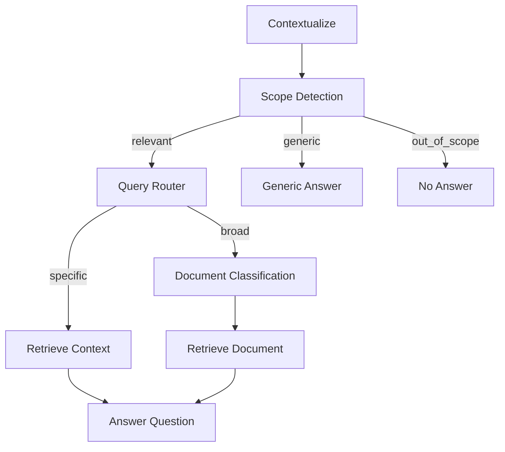

# Talk To CV: Personal Portfolio & RAG Assistant

A personal portfolio site with a conversational assistant that answers questions about your background, projects and experience. The frontend is a static site serving markdown content. The backend is a Python RAG pipeline with hybrid retrieval, a lightweight inference layer built with [Pocketflow](https://github.com/The-Pocket/PocketFlow) and an LLM for response generation.

---

## Architecture

The system is split into two independent components: a static frontend and a backend API.

```
frontend/                        backend/
├── content/                     ├── app.py
│   ├── education.md             ├── cfg.yml
│   └── ...                      ├── prompts.yml
├── css/                         ├── utils/
│   ├── style.css                │   ├── embedding.py
│   └── markdown.css             │   ├── parsing.py
├── js/                          │   └── llm.py
│   ├── app.js                   ├── inference/
│   └── markdown.js              │   ├── flow.py
└── index.html                   │   ├── nodes.py
                                 │   └── retriever.py
                                 ├── data_pipeline/
                                 │   ├── chunking.py
                                 │   └── indexers.py
                                 └── data/
                                     ├── education.md
                                     └── ...
```

### Backend

The backend is a FastAPI application exposing a single inference endpoint. The pipeline is orchestrated with Pocketflow: a minimal framework that supports complex patterns with no external dependencies.

#### Inference Flow



Each incoming query goes through the following steps:

1. **Contextualize** - rewrites the query using conversation history to resolve coreferences and produce a standalone question.
2. **Scope Detection** - classifies the query into one of three buckets:
   - `relevant` → passes to the query router
   - `generic` → answered directly without retrieval
   - `out_of_scope` → rejected with a fixed response
3. **Query Router** - distinguishes between specific and broad queries:
   - `specific` → hybrid retrieval (BM25 + FAISS)
   - `broad` → document classification path
4. **Retrieve Context** (specific path) - runs hybrid BM25 + FAISS retrieval over chunked content.
5. **Document Classification** (broad path) - uses the LLM to identify which source document is most relevant to the query, then reads it in full (possible if the content to read is not too long). This handles broad questions where chunked retrieval would return fragmented or insufficient context.
6. **Answer Question** - generates the final response from retrieved context using the LLM.

#### Models

| Model Type | Model |
|------------|---|
| LLM        | `mistral-small-3.2-24b-instruct-2506` |
| Embeddings | `qwen3-embedding-8b` |

***N.B:*** You should provide your own keys and base_url for both the embedding model and llm. You could use a .env file placed at the root of the project see Environment Variables below.

#### Data Pipeline

The `data_pipeline` module handles preprocessing: the markdown content files are chunked, embedded and indexed into both a FAISS vector index and a BM25 index. These are serialized to disk and loaded at startup. The same markdown files used by the frontend are the source of truth for the backend. But one could consider to add further content.

***N.B:*** The document chunking and retrieval pipelines expect the following .md structure:
```
preamble
└── ## Section (parent)
    └── ### Subsection (child)
```
for the chunking and retrieval to work as intended you should keep in mind the .md drafting instructions included in the frontend/content/*.md files

### Frontend

A static site with no build step. Markdown files are fetched and rendered client-side. The assistant interface sends queries to the backend API and sends responses back into the page.

---

## Setup

### Prerequisites

- Python 3.10+
- API keys for the LLM and embedding providers

### Environment Variables

Create a `.env` file in `backend/` with the following:

```env
LLM_KEY=...
LLM_URL=...
EMBEDDING_KEY=...
EMBEDDING_URL=...
```

### Install Dependencies

```bash
pip install -r requirements.txt
```

### Build the Indexes

Run the data pipeline to chunk the content and build the BM25 and FAISS indexes:

```bash
python -m backend.data_pipeline.indexers
```

This will read the markdown files from `backend/data/` and write the serialized indexes to the same directory.

### Run the Backend

```bash
 uvicorn backend.app:app --reload
```

### Run the Frontend

The frontend is a static site. You can serve it locally with any static server:

```bash
cd frontend
python -m http.server 8080
```

Then open `http://localhost:8080`.

## Logging
 
Each request is logged as a structured JSON record containing:
 
| Field | Description |
|---|---|
| `timestamp` | UTC time of the request |
| `ip` | Client IP address |
| `query` | Original user query |
| `contextualized_query` | Rewritten query after contextualization |
| `answer` | Generated response |
| `route` | Inference path taken (`specific`, `broad`, `generic`, `out_of_scope`) |
| `relevance` | Scope detection result |
| `retrieved_context` | Chunks returned by retrieval (if any) |
| `read_document` | Document read in full on the broad path (if any) |
| `history` | Conversation history up to the current turn |
 
---

## Configuration

Backend behavior is controlled by two YAML files:

- **`cfg.yml`** — model names, retrieval parameters (top-k, llm params and so on), chunking settings.
- **`prompts.yml`** — all prompt templates used across the inference nodes.